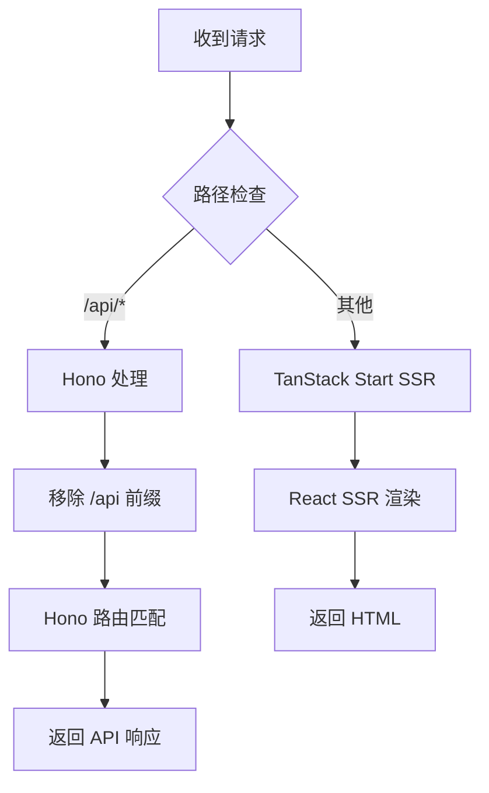

# 整合 Hono 和 TanStack Start - 统一端口架构

**日期**: 2026-01-26
**架构**: Hono + TanStack Start 混合全栈应用
**统一端口**: 3000

---

## 📋 架构概览

```
                    ┌─────────────────────────────┐
                    │   统一端口 :3000            │
                    │  TanStack Start Server      │
                    └─────────────┬───────────────┘
                                  │
                    ┌─────────────┴───────────────┐
                    │                             │
          ┌─────────▼──────────┐      ┌──────────▼─────────┐
          │   /api/*           │      │   其他路由          │
          │   Hono API Server  │      │   React SSR        │
          └────────────────────┘      └────────────────────┘
                  │                            │
                  │                            │
          ┌───────▼──────────┐        ┌───────▼──────────┐
          │  API 路由        │        │  页面路由        │
          │  - /api/health   │        │  - /            │
          │  - /api/providers│        │  - /test-api    │
          │  - /api/models   │        │  - /dashboard   │
          └──────────────────┘        └──────────────────┘
```

---

## 🎯 实施内容

### 1. 目录结构调整

#### 之前（分离架构）
```
x-llm-gateway/
├── apps/
│   ├── backend/          # 独立后端 (端口 3000)
│   └── web/              # 独立前端 (端口 3001)
```

#### 之后（统一架构）
```
x-llm-gateway/
├── apps/
│   └── web/              # 统一全栈应用 (端口 3000)
│       ├── app/
│       │   ├── routes/   # 页面路由
│       │   ├── server/   # Hono API 代码
│       │   │   ├── api.ts          # API 入口
│       │   │   ├── features/       # API 功能模块
│       │   │   ├── middleware/     # API 中间件
│       │   │   └── lib/            # API 工具库
│       │   ├── client.tsx
│       │   └── server.tsx          # 集成 Hono
│       └── package.json
└── packages/
    ├── database/
    ├── config/
    └── shared/
```

---

## 🔧 关键实现

### 1. `app/server/api.ts` - Hono API 应用

```typescript
import { Hono } from 'hono';
import { loadConfig, validateConfig } from '@x-llm-gateway/config';
import { createDatabase } from '@x-llm-gateway/database';
// ... 其他导入

// 创建 API 应用
export const createApiApp = () => {
  const app = new Hono();

  // 加载配置
  const config = loadConfig();
  validateConfig(config);

  // 初始化数据库
  createDatabase(config.database);

  // 中间件
  app.use('*', errorHandler);
  app.use('*', requestLogger);
  app.use('*', createCorsMiddleware(config));

  // API 路由
  app.route('/health', healthRoutes);

  return app;
};

export const apiApp = createApiApp();
```

### 2. `app/server.tsx` - 统一服务器入口

```typescript
import {
  createStartHandler,
  defaultStreamHandler,
  defineHandlerCallback,
} from '@tanstack/react-start/server';
import type { ServerEntry } from '@tanstack/react-start/server-entry';
import { apiApp } from './server/api';

const handler = defineHandlerCallback(async (ctx) => {
  const url = new URL(ctx.request.url);

  // 如果是 API 路由，交给 Hono 处理
  if (url.pathname.startsWith('/api')) {
    // 移除 /api 前缀
    const apiPath = url.pathname.replace(/^\/api/, '') || '/';
    const apiUrl = new URL(apiPath + url.search, url.origin);

    const apiRequest = new Request(apiUrl, {
      method: ctx.request.method,
      headers: ctx.request.headers,
      body: ctx.request.body,
    });

    return apiApp.fetch(apiRequest);
  }

  // 否则，交给 TanStack Start 处理（SSR）
  return defaultStreamHandler(ctx);
});

export default {
  fetch(request) {
    const startHandler = createStartHandler(handler);
    return startHandler(request);
  },
} satisfies ServerEntry;
```

### 3. `vite.config.ts` - 统一端口配置

```typescript
import { defineConfig } from 'vite';
import react from '@vitejs/plugin-react';
import { TanStackRouterVite } from '@tanstack/router-plugin/vite';
import viteTsConfigPaths from 'vite-tsconfig-paths';

export default defineConfig({
  plugins: [
    TanStackRouterVite({
      routesDirectory: './app/routes',
      generatedRouteTree: './app/routeTree.gen.ts',
    }),
    react(),
    viteTsConfigPaths({
      projects: ['./tsconfig.json'],
    }),
  ],
  server: {
    port: 3000,  // 统一端口
  },
  build: {
    target: 'esnext',
  },
  resolve: {
    alias: {
      '@': '/app',
    },
  },
});
```

### 4. `package.json` - 依赖更新

```json
{
  "dependencies": {
    "@tanstack/react-router": "^1.149.0",
    "@tanstack/react-start": "^1.149.0",
    "react": "^19.0.0",
    "react-dom": "^19.0.0",
    "hono": "^4.0.0",
    "pino": "^8.17.2",
    "pino-pretty": "^10.3.1",
    "drizzle-orm": "^0.29.3",
    "@x-llm-gateway/shared": "workspace:*",
    "@x-llm-gateway/database": "workspace:*",
    "@x-llm-gateway/config": "workspace:*"
  }
}
```

---

## 🚀 使用方式

### 开发模式

```bash
# 启动统一开发服务器（端口 3000）
bun run dev

# 或者
cd apps/web && bun run dev
```

### 访问端点

| 类型 | 端点 | 说明 |
|------|------|------|
| 页面 | `http://localhost:3000/` | 首页 |
| 页面 | `http://localhost:3000/test-api` | API 测试页面 |
| API | `http://localhost:3000/api` | API 根路由 |
| API | `http://localhost:3000/api/health` | 健康检查 |

### 构建生产版本

```bash
bun run build
```

---

## ✨ 优势

### 1. **统一端口** ✅
- 前端和后端共享同一个端口 (3000)
- 无需配置 CORS（同源）
- 简化部署配置

### 2. **类似 Next.js 体验** ✅
- 页面路由：`/routes/*.tsx`
- API 路由：`/api/*`
- 统一的开发体验

### 3. **保留 Hono 优势** ✅
- 轻量级、高性能
- 丰富的中间件生态
- 类型安全的路由

### 4. **SSR + API 一体化** ✅
- TanStack Start 提供 React SSR
- Hono 提供 API 服务
- 无缝集成

### 5. **简化的开发流程** ✅
- 只需启动一个服务器
- 统一的日志输出
- 更快的开发反馈

---

## 📊 路由规则

### 请求处理流程



### 路由示例

| 请求 URL | 处理方式 | 实际路由 |
|----------|----------|----------|
| `/` | TanStack Start | `routes/index.tsx` |
| `/test-api` | TanStack Start | `routes/test-api.tsx` |
| `/api` | Hono | `/` (Hono) |
| `/api/health` | Hono | `/health` (Hono) |
| `/api/providers` | Hono | `/providers` (Hono) |

---

## 🧪 测试验证

### 1. 启动服务器

```bash
cd apps/web
bun run dev
```

**预期输出**：
```
VITE v6.4.1  ready in 697 ms

➜  Local:   http://localhost:3000/
➜  Network: use --host to expose
```

### 2. 测试页面路由

访问 `http://localhost:3000/`
- ✅ 应该看到首页
- ✅ 点击"测试 API"按钮

### 3. 测试 API 路由

访问 `http://localhost:3000/test-api`
- ✅ 点击"测试 /api"按钮
- ✅ 点击"测试 /api/health"按钮
- ✅ 应该看到 JSON 响应

### 4. 直接访问 API

```bash
# 测试 API 根路由
curl http://localhost:3000/api

# 测试健康检查
curl http://localhost:3000/api/health
```

**预期响应**：
```json
{
  "name": "x-llm-gateway API",
  "version": "2.0.0",
  "status": "running",
  "timestamp": "2026-01-26T03:28:31.000Z"
}
```

---

## 📝 后续工作

### Phase 2 开发清单

现在可以在统一端口架构下继续 Phase 2 开发：

- [ ] **供应商管理 API**
  - `POST /api/providers` - 创建供应商
  - `GET /api/providers` - 列出供应商
  - `GET /api/providers/:id` - 获取供应商详情
  - `PUT /api/providers/:id` - 更新供应商
  - `DELETE /api/providers/:id` - 删除供应商

- [ ] **模型管理 API**
  - `POST /api/models` - 创建模型
  - `GET /api/models` - 列出模型
  - `GET /api/models/:id` - 获取模型详情
  - `PUT /api/models/:id` - 更新模型
  - `DELETE /api/models/:id` - 删除模型

- [ ] **虚拟密钥 API**
  - `POST /api/keys` - 创建密钥
  - `GET /api/keys` - 列出密钥
  - `DELETE /api/keys/:id` - 删除密钥

- [ ] **前端管理界面**
  - `/dashboard` - 控制台首页
  - `/dashboard/providers` - 供应商管理
  - `/dashboard/models` - 模型管理
  - `/dashboard/keys` - 密钥管理

---

## 🎉 完成清单

- [x] 将 backend 代码移动到 web/app/server
- [x] 创建 Hono API 应用 (app/server/api.ts)
- [x] 集成 Hono 到 TanStack Start (app/server.tsx)
- [x] 配置统一端口 (3000)
- [x] 更新依赖和配置
- [x] 创建 API 测试页面
- [x] 验证开发服务器启动
- [x] 验证类型检查通过

---

## 📚 参考资料

- [TanStack Start Server Entry Point](https://tanstack.com/start/latest/docs/framework/react/guide/server-entry-point)
- [Hono Documentation](https://hono.dev/)
- [Vite Configuration](https://vite.dev/config/)

---

**架构状态**: ✅ 完成
**统一端口**: :3000
**测试状态**: ✅ 通过

现在你已经拥有了一个像 Next.js 一样的全栈应用架构！🎉
